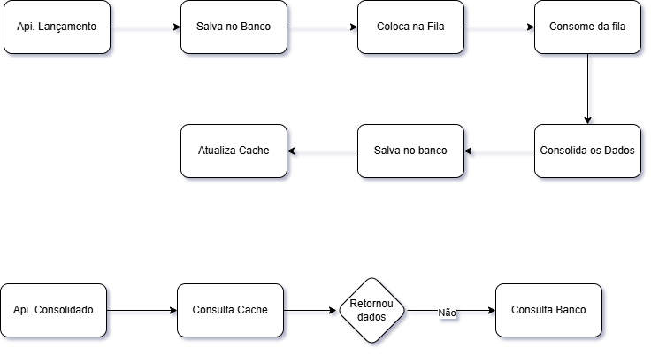

# Solução Arquitetural: Migração para Microservices Event-Driven no Azure  
**Controle de Fluxo de Caixa Diário para Comerciantes**

## Visão Geral

Solução para migração gradual de um sistema legado monolítico (.NET MVC + WCF + SQL Server compartilhado) para arquitetura cloud-native no Azure, com foco em:

- Controle de lançamentos (débitos/créditos)
- Consolidação diária de saldo
- Alta disponibilidade, escalabilidade e resiliência
- Segurança corporativa e conformidade
- Desacoplamento via eventos (event-driven)

**Tecnologias principais**  
- .NET 8
- Azure Kubernetes Service (AKS)  
- Azure SQL Database (Elastic Pool)  
- Azure Cache for Redis  
- Azure Service Bus (Pub/Sub)  
- Azure API Management + Application Gateway + WAF  
- Microsoft Entra ID (JWT)  
- Application Insights + Azure Monitor  

**Padrões adotados**  
- Domain-Driven Design (Vertical Slice)  
- Clean Architecture + MediatR + CQRS lite  
- Event-Driven Architecture  
- Strangler Pattern (migração incremental)  
- Anti-Corruption Layer (ACL) durante transição  

## Overview Arquitetura
- **[Arquitetura As-Is / To-Be](./docs/arch/architecture-overview.md)**

Fluxo principal:  
1. Comerciante → Application Gateway → WAF → APIM → Transactions Service  
2. Transactions publica evento no Service Bus  
3. Consolidated Service consome, atualiza saldo e cache em Redis  
4. Consulta de lançamentos/saldo via API com cache  

## Domínios e Capacidades de Negócio

Core Domain: Gestão de Fluxo de Caixa Diário  

| Subdomínio       | Tipo DDD     | Capacidades Principais                              | Tecnologias Principais                  |
|------------------|--------------|-----------------------------------------------------|-----------------------------------------|
| Transactions     | Core         | Registrar lançamento, validar, publicar evento      | .NET API, MediatR, Service Bus          |
| Consolidated     | Supporting   | Consumir eventos, consolidar saldo diário, cache    | .NET Worker, Redis, Azure SQL           |
| Integração Legado| Anti-Corruption | Isolar modelo legado durante migração             | ACL no APIM / Gateway                   |

Detalhes: [domain.md](./docs/arch/domain.md)

## Requisitos Principais

**Não-funcionais críticos**  
- Disponibilidade ≥ 99.9%  
- Latência p99 ≤ 500 ms  
- Escalabilidade horizontal (50 RPS pico)  
- Resiliência: retry, circuit breaker, DLQ, AZ-redundancy  
- Segurança: JWT, Private Endpoint, WAF, RBAC  

Tabela completa: [requirements.md](./docs/arch/requirements.md)

## Decisões Arquiteturais

**ADR-001** – Adotar Microservices Event-Driven com Azure para migração gradual  
- Justificativa: desacoplamento, resiliência, escalabilidade  
- Alternativas: monolito refatorado, serverless puro  
- Riscos mitigados: Strangler + A/B testing via APIM  

Detalhes: [adr.md](./docs/arch/adr.md)

### Estrutura do Projeto

Projeto organizado em **Vertical Slice Architecture** + **Clean Architecture**, com separação clara por feature e camadas de responsabilidade:

## Estimativa de Custos Mensais (Brazil South – pay-as-you-go – 2026)

Premissas:  
- Uso médio-baixo (10–50 RPS pico Prod, ~20–50k eventos/dia)  
- Dev/Stg desligados fora horário comercial (~60% redução)  
- Sem reservas/Savings Plan (valores conservadores)

| Ambiente | Componentes Principais                          | Custo Estimado (BRL) |
|----------|-------------------------------------------------|----------------------|
| Dev      | AKS básico (1–2 nodes), SQL básico, Service Bus | 2.250 – 5.150           |
| Staging  | AKS médio, SQL médio, Redis, APIM               | 5.750 – 12.150         |
| Prod     | AKS 3 nodes/3 AZs, SQL Elastic Pool, Redis Premium, Service Bus, APIM, Gateway | 23.000 – 45.000       |

Detalhes e premissas: [cost-estimate.md](./docs/arch/cost-estimate.md)

## Resiliência e Segurança

- **Resiliência**  
  - Redundância: AKS multi-AZ, SQL zone-redundant, Redis Premium  
  - Failover: HPA + health probes, DLQ Service Bus  
  - Recuperação: Polly (retry/circuit breaker), point-in-time restore SQL  
  - Monitoramento proativo: Application Insights + alertas (queue backlog, 5xx, latency)

- **Segurança**  
  - Autenticação: Entra ID + JWT  
  - Exposição: Private Endpoint + WAF + APIM policies  
  - Dados: Encryption at-rest/transit, RBAC, Key Vault

## Próximos Passos

1. Implementar Consolidated Service completo  
2. Configurar CI/CD end-to-end (Azure Pipelines + ACR + AKS)  
3. Testes de carga e chaos engineering  
4. Monitoramento avançado + alertas  
5. Evoluções: ML previsão de caixa, Power BI, serverless, Self-Healing
6. Multi-Cloud Disaster Recovery

## Intruções
- Pré-requisitos:
  - [Docker Instalado (O projeto foi desenvolvido utilizando o docker via WSL)](./docs/arch/install.docker.wsl.md)
  - Visual Studio com .net 8
- Montando ambiente:
  - Subir o docker-compose localizado em: [/src/01.infrastructure/docker-compose.yml](./src/01.infrastructure/docker-compose.yml)
- Configurando Visual Studio:
  - Para simplificar a utilização, configure para ter multiples Startup Projects (Botão direito em qual projeto -> Configure Startup Projects) e deixe conforme a figura à seguir 
- Exemplos de chamadas curl:
  - api.financial.transactions
    -  [POST] api/Lancamentos: Realiza lançamentos no fluxo de caixa, os valores aceitos para Tipo são: credito ou debito;
      ```
          curl -X 'POST' \
            'http://localhost:5288/api/Lancamentos' \
            -H 'accept: */*' \
            -H 'Content-Type: application/json' \
            -d '{
            "tipo": "credito",
            "valor": 250,
            "data": "2026-02-19T09:38:51.591Z",
            "descricao": "test"}'
      ```
    - [GET] - api/Lancamentos - Lista paginada dos lançamentos
    ```
      curl -X 'GET' \
        'http://localhost:5288/api/Lancamentos/por-dia?data=2026-02-18&pagina=1&tamanhoPagina=20' \
        -H 'accept: text/plain'
    ```
  - api.financial.consolidated
    - [GET] api/consolidado - Consulta o consolidado do dia
    ```
      curl -X 'GET' \
      'http://localhost:5173/api/consolidado?data=2026-02-18' \
      -H 'accept: */*'
    ```
- Fluxo simples da aplicação do teste
  

## Referências

- [Visão Arquitetural Geral](./docs/arch/architecture-overview.md)  
- [Mapeamento de Domínio](./docs/arch/domain.md)  
- [Requisitos Refinados](./docs/arch/requirements.md)  
- [Decisão ADR-001](./docs/arch/adr.md)  
- [Estimativa de Custos](./docs/arch/cost-estimate.md)  
- [Instalação Docker no WSL](./docs/arch/install.docker.wsl.md)  

Solução alinhada aos princípios de arquitetura corporativa, escalável, resiliente e reutilizável.