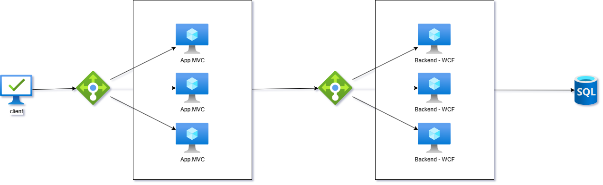
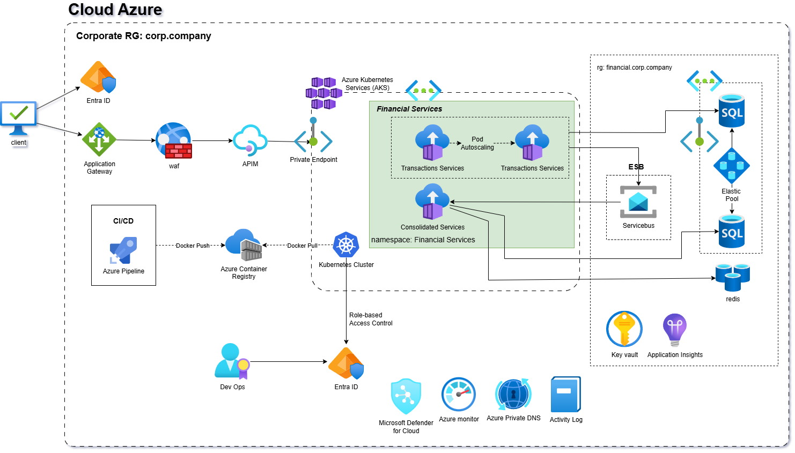

# Visão Arquitetural da Solução - Fluxo de Caixa Diário

## Introdução

A solução proposta parte de um **sistema legado monolítico** (hipotético, baseado em .NET MVC + WCF + SQL Server compartilhado) e evolui para uma arquitetura moderna **cloud-native no Azure**, utilizando **microservices event-driven** hospedados em **AKS**, com decoupling assíncrono via **Azure Service Bus**, cache em **Redis**, exposição segura via **APIM + Application Gateway + WAF**, e autenticação/autorização via **Microsoft Entra ID**.

A migração é realizada de forma gradual através do **Strangler Pattern**, com uma **Anti-Corruption Layer (ACL)** protegendo os novos domínios bounded do legado durante a transição.

Abaixo apresentamos os três estágios da arquitetura:

1. **As Is** – Estado atual do legado monolítico (acoplado, escalabilidade limitada).
2. **Transition** – Fase de coexistência (Strangler + ACL), permitindo migração incremental sem downtime.
3. **To Be** – Arquitetura Alvo (cloud-native, escalável, resiliente e segura).

Todas as imagens estão na pasta `docs/arch/` e foram exportadas de ferramentas como Draw.io.

## 1. Arquitetura As Is (Estado Atual – Legado Monolítico)

O sistema legado é um monolito com frontend MVC e backend WCF compartilhando o mesmo banco SQL. Há acoplamento forte entre lançamentos e consolidação, violando os requisitos de independência e escalabilidade.

**Principais limitações observadas:**
- Acoplamento alto (mesmo DB e lógica compartilhada).
- Dificuldade em escalar apenas o consolidado para picos de 50 RPS.
- Falta de resiliência: falha em um módulo afeta todo o sistema.
- Segurança limitada (sem WAF, auth centralizada ou private networking).
- Escalonamento vertical.

## 2. Arquitetura de Transição (Strangler Pattern + ACL)

Durante a migração, introduzimos uma **Anti-Corruption Layer (ACL)** para isolar os novos microservices do legado. O tráfego é roteado gradualmente (via APIM ou load balancer) para os novos serviços, enquanto o legado continua atendendo parte das requisições. Eventos são publicados para o Service Bus, permitindo coexistência sem quebra de contrato.

**Estratégia de migração incremental:**
- Extração primeiro do Financial Transaction Service (lançamentos), depois do Consolidated Service.
- ACL traduz chamadas legadas (WCF → novos microservices).
- Testes paralelos (A/B via APIM) e monitoramento para validar antes de cutover.
- Tempo estimado: 9–12 meses, minimizando riscos e downtime.

## 3. Arquitetura Alvo (To Be – Cloud-Native no Azure)

Estado final: dois microservices independentes em **AKS** (namespace Financial Services), com autoscaling de pods, decoupling total via **Azure Service Bus**, cache distribuído em **Redis**, persistência otimizada em **Azure SQL Elastic Pool**, e exposição segura via **APIM + Application Gateway + WAF + Entra ID**. Observabilidade completa com **Application Insights** e segurança reforçada com **Key Vault**, **Microsoft Defender for Cloud** e **Private Endpoints**.

**Principais benefícios alcançados:**
- **Independência total**: Lançamentos continuam funcionando mesmo se Consolidated cair (Service Bus bufferiza eventos).
- **Escalabilidade**: Autoscaling horizontal em AKS, Scaling do Banco de dados, Scaling do ServiceBus.
- **Resiliência**: Zone-redundancy, circuit breakers, dead-letter queues.
- **Segurança**: Entra ID JWT + APIM policies + WAF + Private Link + Always Encrypted.
- **Observabilidade**: Traces, métricas e logs centralizados.
- **Reutilização**: Serviços bounded podem ser consumidos por outros sistemas (BI, ERP futuro).
- **Infraestrutura**: Automações com IaC (Infrastructure as Code)

## Decisões Arquiteturais Principais (ADRs)

Todas as escolhas (microservices event-driven, AKS, Service Bus, APIM Premium, etc.) estão justificadas em Architecture Decision Records (ADRs) na pasta `/docs/arch/`.

- [ADR-001: Adoção de Microservices Event-Driven no Azure](adr.md)
- [Outros ADRs em breve...]

## Próximos Passos e Evoluções Futuras

- Implementação completa dos microservices em .NET 8/9 (CQRS + MediatR).
- CI/CD full com Azure Pipelines + ACR + AKS.
- Monitoramento avançado (alertas para queue backlog, RPS, erros 5xx).
- Evoluções: Integração com Power BI para relatórios avançados, ML para previsão de caixa, serverless para partes não-críticas, Self-Healing.

Essa arquitetura foca em ser escalável, resiliente e segura, suportando a estratégia de crescimento da organização.
