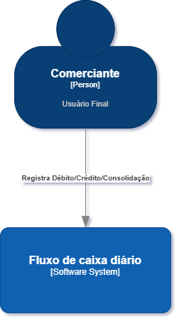
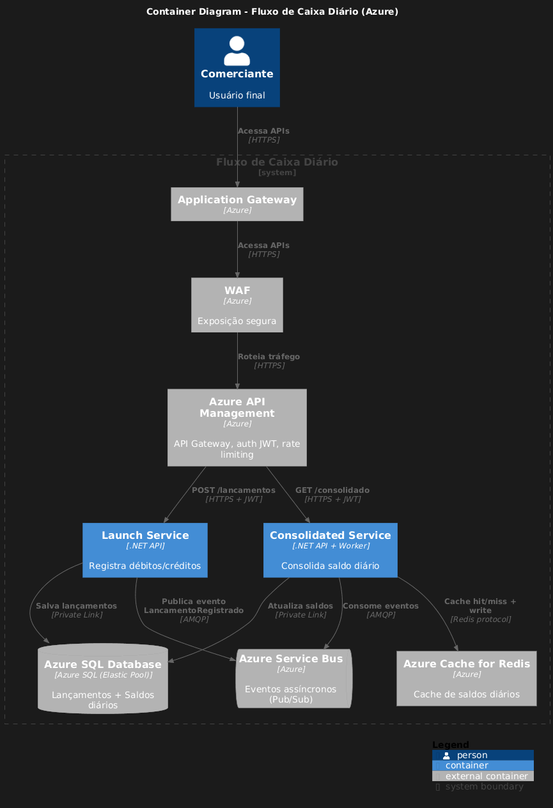

## Mapeamento de Domínios Funcionais e Capacidades de Negócio

Usando conceitos de **Domain-Driven Design (DDD)** para decompor o problema de forma clara e alinhada à estratégia de negócios do comerciante.

### Domínio Principal: Financial (Core Domain)
**Gestão de Fluxo de Caixa Diário**

Subdomínios identificados:

| Subdomínio                  | Tipo (DDD)         | Descrição                                                                 | Capacidades de Negócio Principais                                                                 | Prioridade para o Negócio |
|-----------------------------|--------------------|---------------------------------------------------------------------------|----------------------------------------------------------------------------------------------------|---------------------------|
| Lançamentos de Caixa        | Core Domain        | Registro detalhado de todas as movimentações financeiras (débitos e créditos) que afetam o caixa. | - Registrar lançamento (crédito/débito, valor, data, descrição, categoria opcional) - Listar lançamentos por dia/período - Validar integridade (valor > 0, data válida, tipo correto) - Auditoria básica (imutabilidade após registro) | Alta – Impacta diretamente a cadeia de valor (fluxo real de dinheiro) |
| Consolidado Diário          | Supporting Domain  | Agregação e relatório do saldo consolidado por dia (créditos - débitos), com métricas complementares. | - Calcular saldo diário consolidado - Gerar relatório (saldo, total créditos, total débitos, número de transações) - Consultar saldo histórico (por data) - Cache e pré-cálculo para performance em picos | Média-Alta – Essencial para visibilidade e tomada de decisão, mas depende do core |
| Gestão de Referências       | Generic Domain     | Cadastros auxiliares (ex.: categorias de lançamento, contas vinculadas).  | - Manter categorias (vendas, despesas operacionais, etc.) - Integrações futuras com ERPs/bancos, BIs   | Baixa – Pode ser legado ou externo |

### Justificativa da Decomposição
- **Segregação de capacidades**: Lançamentos é independente do Consolidado → atende requisito não-funcional: "O serviço de controle de lançamento não deve ficar indisponível se o sistema de consolidado diário cair".
- **Cadeia de valor**: Lançamentos geram eventos → Consolidado atualiza agregados → entrega valor (visão financeira diária para decisões do comerciante).
- **Trade-offs**: Evitar monolito (acoplamento alto) → bounded contexts separados para escalabilidade e reutilização futura.

### Capacidades de Negócio Mapeadas (Níveis)
**Nível 1 (Macro-capacidade)**  
Gestão Financeira de Caixa Diário 

**Nível 2 (Sub-capacidades)**  
- Registrar Movimentações Financeiras (Core)  
- Consolidar e Reportar Saldo Diário  
- Consultar Histórico de Caixa  
- Garantir Integridade e Auditoria   

### Context Mapping (Integração entre Domínios)
- **Upstream → Downstream**: Financial Transactions Service publica eventos ("LancamentoRegistrado") → Consolidated Service consome e atualiza saldos.  
- **Padrão**: Event-Driven (Azure Service Bus) → decoupling, resiliência e eventual consistency aceitável para relatórios diários.  
- **Durante transição de legado**: Anti-Corruption Layer (ACL) para isolar modelos novos do legado.
